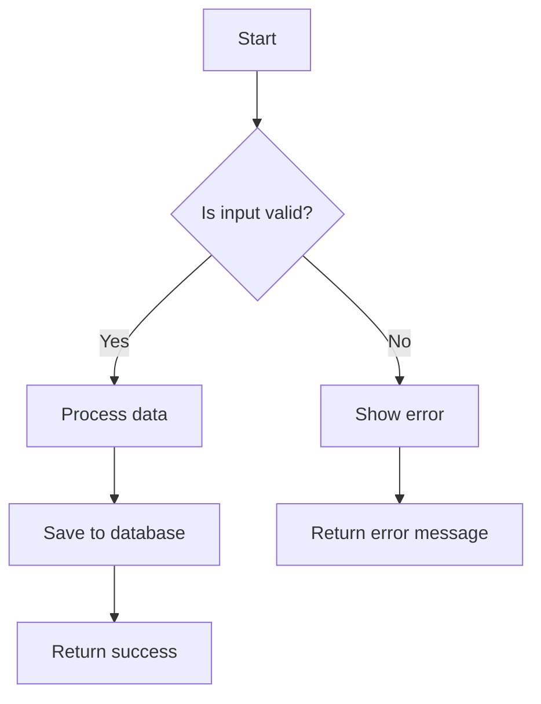
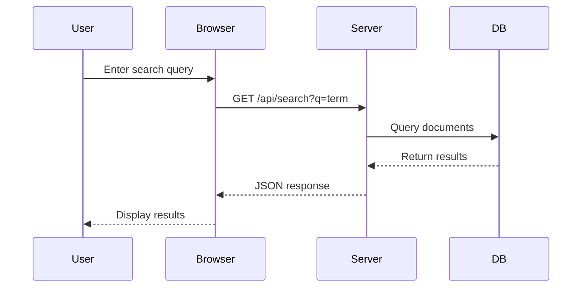

# Rich Content Demo

This document demonstrates the various rich content rendering capabilities supported by WebDoc.

## Math Formulas

### Inline Math

The quadratic formula is $x = \frac{-b \pm \sqrt{b^2 - 4ac}}{2a}$, which gives solutions to any equation of the form $ax^2 + bx + c = 0$.

Euler's identity states that $e^{i\pi} + 1 = 0$, connecting five fundamental constants.

### Block Math

The Gaussian integral:

$$
\int_{-\infty}^{\infty} e^{-x^2} \, dx = \sqrt{\pi}
$$

A matrix equation:

$$
\begin{bmatrix} a & b \\ c & d \end{bmatrix} \begin{bmatrix} x \\ y \end{bmatrix} = \begin{bmatrix} ax + by \\ cx + dy \end{bmatrix}
$$

The summation formula for a geometric series:

$$
\sum_{k=0}^{n} ar^k = a \cdot \frac{1 - r^{n+1}}{1 - r}, \quad r \neq 1
$$

## Mermaid Diagrams

### Flowchart



### Sequence Diagram



## DrawIO Diagrams

The following is an embedded DrawIO XML diagram:

```drawio
<mxGraphModel>
  <root>
    <mxCell id="0"/>
    <mxCell id="1" parent="0"/>
    <mxCell id="2" value="Client" style="rounded=1;whiteSpace=wrap;fillColor=#dae8fc;strokeColor=#6c8ebf;" vertex="1" parent="1">
      <mxGeometry x="100" y="100" width="120" height="60" as="geometry"/>
    </mxCell>
    <mxCell id="3" value="API Server" style="rounded=1;whiteSpace=wrap;fillColor=#d5e8d4;strokeColor=#82b366;" vertex="1" parent="1">
      <mxGeometry x="320" y="100" width="120" height="60" as="geometry"/>
    </mxCell>
    <mxCell id="4" value="Database" style="shape=cylinder3;whiteSpace=wrap;fillColor=#fff2cc;strokeColor=#d6b656;" vertex="1" parent="1">
      <mxGeometry x="540" y="90" width="100" height="80" as="geometry"/>
    </mxCell>
    <mxCell id="5" value="HTTP Request" style="edgeStyle=orthogonalEdgeStyle;" edge="1" source="2" target="3" parent="1">
      <mxGeometry relative="1" as="geometry"/>
    </mxCell>
    <mxCell id="6" value="SQL Query" style="edgeStyle=orthogonalEdgeStyle;" edge="1" source="3" target="4" parent="1">
      <mxGeometry relative="1" as="geometry"/>
    </mxCell>
  </root>
</mxGraphModel>
```

## Code Blocks

### TypeScript

```typescript
interface Document {
  slug: string;
  locale: string;
  category: string;
  title: string;
  content: string;
}

async function getDocumentBySlug(
  locale: string,
  category: string,
  slug: string
): Promise<Document | null> {
  const filePath = path.join(CONTENT_DIR, locale, category, `${slug}.md`);

  if (!fs.existsSync(filePath)) {
    return null;
  }

  const raw = await fs.promises.readFile(filePath, 'utf-8');
  const { data, content } = matter(raw);

  return {
    slug,
    locale,
    category,
    title: data.title ?? slug,
    content,
  };
}
```

### Python

```python
def fibonacci(n: int) -> list[int]:
    """Generate the first n Fibonacci numbers."""
    if n <= 0:
        return []
    elif n == 1:
        return [0]

    sequence = [0, 1]
    for _ in range(2, n):
        sequence.append(sequence[-1] + sequence[-2])
    return sequence


# Example usage
print(fibonacci(10))
# Output: [0, 1, 1, 2, 3, 5, 8, 13, 21, 34]
```

### CSS

```css
.immersive-mode {
  max-width: 720px;
  margin: 0 auto;
  padding: 2rem;
  font-size: 1.125rem;
  line-height: 1.8;
}

@media (prefers-color-scheme: dark) {
  .immersive-mode {
    background-color: #1a1a2e;
    color: #e0e0e0;
  }
}
```

## Summary

This document demonstrates:

- **Inline math** using `$...$` syntax
- **Block math** using `$$...$$` syntax with fractions, integrals, matrices, and summations
- **Mermaid diagrams** including flowcharts and sequence diagrams
- **DrawIO XML** embedded diagrams
- **Code blocks** with syntax highlighting for multiple languages
